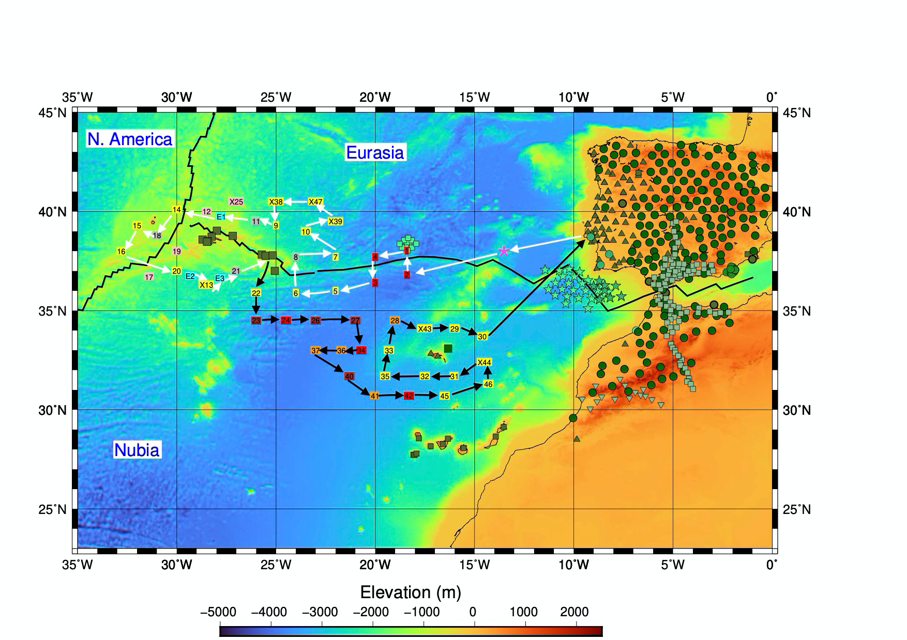

**The countdown is on...3 more days until the start of the UPFLOW expedition**

Whereas the crew and the research staff is counting down the days in quarantine, the preparations for the cruise are in full swing.
Two T-liner trucks full with 32 ocean bottom seismometers (OBS) and associated kit finally arrived to research vessel *RV Mário Ruivo*. The OBSs already took a nearly two weeks road trip, all the way from Bremerhaven in northern Germany down to the harbour in Almada, Portugal. 

The broadband seismometers belong to the DEPAS pool operated by the Alfred Wegener Institute (AWI) in Bremerhaven and the GFZ in Potsdam. The [DEPAS pool](https://www.awi.de/en/science/geosciences/geophysics/methods-and-tools/ocean-bottom-seismometer/depas.html) is the biggest instrument pool for amphibious seismology in Europe, from which one can loan the instruments. This enables amazing marine science projects exploring the  seafloor!

The OBSs, called LOBSTERs, will be stored safely on deck of the research vessel *RV Mário Ruivo* until we deploy them on the ocean bottom in the Azores-Madeira-Canary region.  

The seismometers measure the seismicity of the ocean bottom. We are so excited what the OBSs will 'experience' during the year of deployment... how many earthquakes are they going to record? How many whales are going to visit the OBSs, or pass by the array? How many storms are crossing the array? How is the ocean behaving in our study region?             
**But most important, what will the recordings of the OBSs tell us about the upflowing mantle material beneath the study region?**

To answer all these and more questions, we first need to place the OBSs at the ocean bottom. Our task during the next 5 weeks of expedition is to prepare the OBS for their adventure and release them at suitable places.  The OBSs are very autonomous, during their deployment there's nothing else for it but to cross all fingers for amazing data! 

We can't wait to get the UPFLOW expedition started! 

 *Stay updated: come and experience this adventure with us!*

                                    *Theresa Rein*
